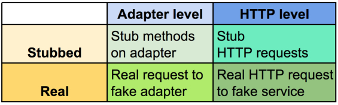

# Weekly Iteration: Faking Third-Party APIs

## Ways to test third party API integration

There are four broad approaches to testing interactions with a 3rd party API:

1) Stub methods on the adapter
2) Swapping the "backend"
3) Stub HTTP (Webmock, directly stub HTTParty, VCR)
4) Real HTTP requests to fake services

These form a matrix (Adapter | HTTP) x (Stubbed | Real)

## Stubbing methods on the adapter

Use when:

* Unit testing an object that uses the adapter

Don't use when:

* Feature testing
* Integration testing

## Swapping the "backend"

Use when:

* You don't own the "backend" and can assume it works
* You want to capture extra information (such as SMS messages)

## Stubbing HTTP

This can be done in many ways:

* Stubbing HTTP lib (`HTTParty`, `Net::HTTP`, etc)
* Webmock
* VCR

Use when:

* Feature testing
* You want to test up to the HTTP layer (including adapters and "backends")

Don't use when

* You need to stub a lot of endpoints. This gets messy.

VCR can be handy if you want to anticipate change. APIs don't change all that
much.

## Swapping the service

Use when:

* Feature testing
* Creating your own sandboxes
* You want to test all the way through the HTTP layer
* You want custom behavior, webhooks, etc on the service

Don't use when:

* Unit testing

[Example](https://github.com/thoughtbot/upcase/blob/master/spec/support/fake_github.rb)

Building a fake can follow these steps:

* Build as Sinatra app
* Package as gem if you want to reuse or develop in separate repo
* Include Rackfile if you want to deploy to Heroku
* Spin up with Capybara webkit
* Use ENV and `cattr_accessor` in adapter to set API base uri

## Extra Resources

[Fake services](https://robots.thoughtbot.com/faking-apis-in-development-and-staging)
[Swapping the client](https://robots.thoughtbot.com/testing-sms-interactions)
